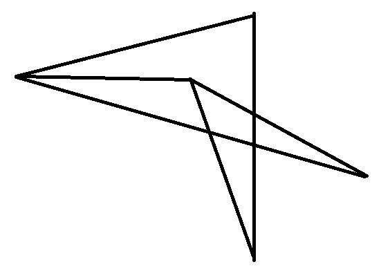
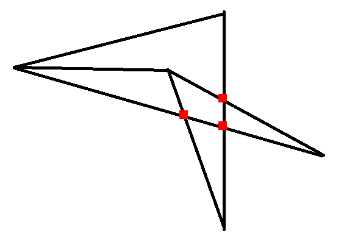

# Отбор на базовую кафедру 1С в МФТИ Михайлов Баир
Задача: несколько точек на картинке соединены отрезками. Найти все точки пересечения.




## Установка


```bash
pip install -r requirements.txt
```

## Запуск программы
```bash
python main.py "Путь до файла"
'q' закрыть программу
```
